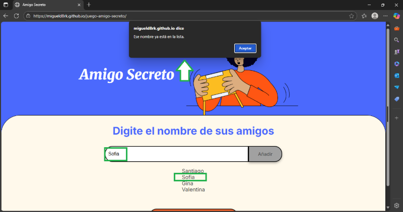

  

## 🎁 Amigo Secreto - Proyecto Web

Bienvenido al proyecto **Amigo Secreto**, una aplicación web interactiva para realizar sorteos entre amigos. Con esta herramienta podrás:

- ✅ Agregar amigos a una lista.
- ✅ Visualizar a los participantes.
- ✅ Realizar sorteos aleatorios de forma sencilla.

Desarrollado con **JavaScript**, **HTML** y **CSS**, este proyecto busca facilitar sorteos entre amigos, familiares o compañeros de trabajo.

---

## 🧠 ¿Cómo funciona?

La lógica del proyecto está dividida en tres funciones principales:

- **Agregar amigos:** El usuario introduce un nombre en un campo de texto. Si el nombre no está repetido ni vacío, se agrega al arreglo `amigos[]` y se actualiza visualmente la lista.
- **Actualizar lista:** Cada vez que se añade o elimina un nombre (por sorteo), se actualiza la lista en pantalla para reflejar los cambios.
- **Sortear:** Al hacer clic en el botón de sorteo, se elige aleatoriamente uno de los nombres del arreglo y se muestra en pantalla.

---

## 🖼️ Capturas y Demostración

### 🎬 Demostración general del funcionamiento

En este GIF puedes ver el flujo completo: añadir nombres, visualizar la lista y realizar un sorteo.

  

---

### ⚠️ Validación de campos vacíos

Si el usuario intenta agregar un nombre sin escribir nada, se activa una alerta para evitar errores de ingreso.

  

---

### 🚫 Validación de nombres duplicados

Si el usuario intenta agregar un nombre que ya ha sido añadido previamente, se mostrará una alerta indicando que ese nombre ya está en la lista.

  

---

### 🔁 Flujo completo del sorteo

En esta demostración, la lista de amigos ya está cargada con cinco nombres.  
Se realizan cinco sorteos consecutivos: cada vez que se selecciona un amigo, se elimina automáticamente de la lista y esta se actualiza en pantalla.  
Al finalizar, se muestra un mensaje indicando que ya no hay más amigos para sortear.

  

---

## ✍️ Autor

Proyecto desarrollado por Miguel Ángel de la Cruz Lázaro como parte de mi formación en desarrollo web.

---

¡Gracias por visitar este repositorio!
